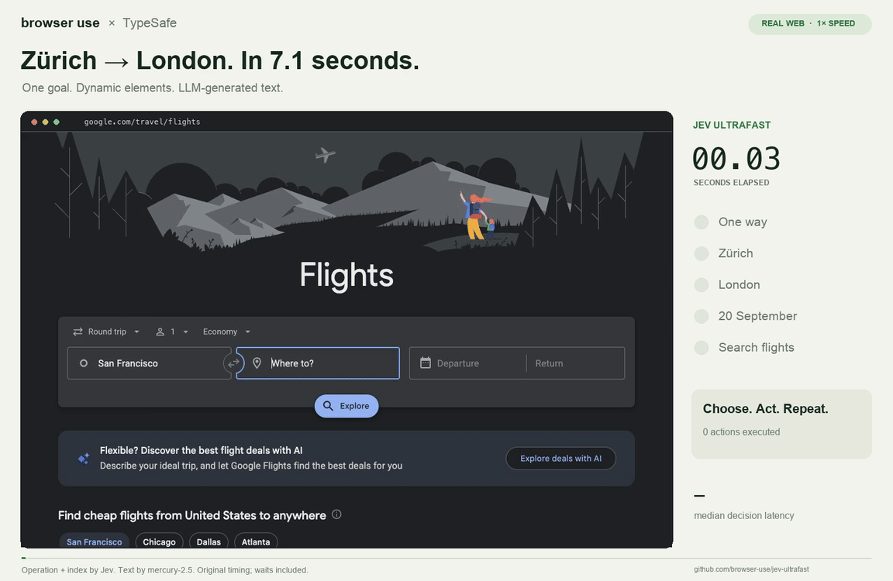

# Jev Ultrafast ⚡

> [!IMPORTANT]
> **The Browser Use Cloud waitlist is open.** Get early access to ultrafast browser agents in the cloud.
> **[Join the waitlist →](https://browser-use.com/ultrafast?utm_source=github&utm_medium=readme&utm_campaign=jev-ultrafast)**

**A browser agent with a dynamic, indexed action space.**

Give it one goal. A finite-choice decision backend picks an operation and an observed element. A small LLM writes text only when the operation is `TYPE_TEXT`. The default backend remains TypeSafe SystemOne/Jev, and any compatible endpoint or injected `DecisionBackend` can be used.

> [!NOTE]
> **v0.4 hardens DREAM-Jev into a qualification control plane.** v0.2's isolated-world browser executor remains fixed and v0.3's bounded replay policy remains the only self-improvable surface. v0.4 adds cross-process hash-chain and policy-registry serialization, replay-evidence binding, train/validation/holdout candidate selection, matched live-canary evidence bound to post-staging runs and the staged parent digest, latency/action/token regression gates, policy lineage checks, suspension, health monitoring, and rollback. A replay winner still cannot activate itself.

> [!NOTE]
> **v0.5 adds authority integrity.** A deterministic effect classifier maps every candidate to a semantic class (`NAVIGATE`, `FORM_EDIT`, `SUBMISSION`, `PURCHASE`, `UNKNOWN_COMMIT`, …) from bounded DOM context — a bare "Continue" is an `UNKNOWN_COMMIT`, and no learned adviser can downgrade a deterministic high-risk classification. Click execution re-verifies page identity, node identity, geometry, and hit-test *between* `mousePressed` and `mouseReleased`; text insertion runs atomically inside the isolated world. Evidence signatures are domain-separated with verification-key rotation, and a crash-torn final JSONL line is recovered without weakening hash/signature checks.
>
> **v0.5.1 closes the residual authority-plane gaps from an independent audit.** The classifier is now strictly monotonic — sensitive target fields (`ctx.field`: credential, card, email, messaging) escalate `fill`/`select`/toggle edits to `DISCLOSURE`/`FINANCIAL`/`AUTHENTICATE` instead of short-circuiting to `FORM_EDIT`, and high-risk labels evaluate before any structural shortcut. Canary evidence pairs by `(task_family, instance_id)` so identical instance ids in different families can never contaminate sign-test statistics. Policy activation is signed authority: every promotion records a domain-separated attestation binding candidate/parent digests, replay and canary evidence digests, the chain head, and the registry revision — `active_policy()` fails closed under configured verification keys when the attestation is missing, forged, or signed by an unexpected key; rollbacks re-verify the original attestation and sign the transition. The store supports a signed chain-head anchor (`--anchor`, `JEV`-independent checkpoint file): a log that no longer reaches the anchored head fails on read *and* on append, so a signed tail disguised as a crash-torn write is detectable rather than silently truncated. Candidate-catalogue digests now bind every replay-relevant field (node, role, option index/label, current value, checked, ctx, overlap), and action `label`/`option_label` text is redacted before model-boundary use. Execution guarantees are explicit: `DOM_ATOMIC` (validate + mutate in one isolated-world turn — default for click/fill/select) versus `TRUSTED_INPUT_NONTRANSACTIONAL` (real CDP mouse input with pre-press/pre-release revalidation; needed for isTrusted-gated elements and non-transactional by nature).
>
> **v0.6.0 adds the first counterfactual learned layer.** `ChoiceModel` (`--choice-model`) is an uncertainty-aware choice prior over the same `(kind, overlap, rank)` cells: it evaluates recorded actions under each *candidate* policy's own recomputed offered rank, carries posterior standard deviation and an explicit abstention flag on sparse cells, and proposes which offered action its upper-confidence score prefers — annotated per candidate as `divergence_rate`/`mean_uncertainty`/`confident_fraction`. A proposal is a hypothesis, never an outcome or evidence: counterfactual predictions cannot open a replay gate, and anything it prefers must still qualify through real executions and bound live canaries.
>
> **v0.6.1 is the audit correction pass.** Traces now record `selected_observed_rank` and `selected_offered_rank` as separate coordinates — v0.6 trained the prior on the observed index while replay queried the offered one — and replay world-building fails closed on `offered_count` or offered-rank mismatches. The `ChoiceModel` target is verified progress rather than `P(page_changed)`: a run's terminal transition counts only when the run ended verifier-confirmed `done`, so a page change that ends in failure does not teach the prior the action was good — the model remains an advisory counterfactual instrument, not a learned decision policy. Unknown mutation kinds now fail closed (`UNKNOWN_COMMIT` → approval) instead of passing as autonomous, and `TYPE_TEXT` runs a second authority pass on the *generated payload* (`classify_payload`) before the browser mutation, so a field that describes itself as plain text cannot launder a card number or credential. Promotion attestations are bound to the complete active record — parent, replay digests, the whole canary block including the health-check reference metrics, timestamp, and revision — and every registry transition is a signed, hash-chained state commit: post-write tampering of even mutable fields like `suspended` fails the state head, and suspend/resume/rollback carry transition attestations chaining to the head they replace.
>
> **v0.7.0 closes the counterfactual loop — carefully.** `improve` now emits `experiment_proposals`: stamped hypotheses of the form "in this state the prior prefers B over the recorded A", ranked by expected delta. `Agent(experiment={"model": choice_model, "rate": ε})` turns those hypotheses into *real* trials: on an eligible step the scheduler executes the proposal (candidate arm) or the model's own choice (control arm) with a recorded `assignment_probability`, capped at one trial per run so outcomes stay attributable. The deviated action passes through the full authority plane — policy assessment, approvals, payload review — so an experiment can never execute what the agent couldn't otherwise do. Trial transitions carry an `experiment` block in signed evidence; `CounterfactualTrials.fit` turns them into self-normalized inverse-propensity estimates of verified progress per arm, with effective sample size so thin support can't masquerade as confidence. Trials never qualify promotion: runs containing an experiment arm are excluded from canary metrics, so a hypothesis must still earn its way through the replay + bound-canary path like everything else.
>
> Two authority gaps from the v0.6.1 audit also close in v0.7.0: approval grants now bind the *generated payload* (`payload_digest`), so approving "fill field X" cannot silently authorize a different text than the one pending — and a `jev-dream/4` registry file without its chained state head fails closed instead of downgrading to legacy format (which would have unprotected mutable fields like `suspended`).
>
> **v0.7.1 fixes the first trial-integrity defects**: approving a deviated trial now executes the *approved* proposal (previously the grant silently resumed the model's original choice and dropped the experiment tag), trial contexts key on the model choice so both arms share a cell, and a stripped signed registry can no longer be laundered into a legacy file by downgrading `schema` under configured trust keys.
>
> **v0.8.0 completes the audit corrections.** Proposals must belong to the *offered* catalogue — the policy-filtered set the model saw — not merely `page["actions"]`. Randomization records `experiment_assigned` **before** the authority plane, so a denied/vetoed/stale trial still marks the run experimental and out of canary; the assignment is an immutable plan binding the offered-catalogue, policy-behavior, model, and proposal digests plus the prior's predicted delta and uncertainty. `CounterfactualTrials` now estimates `p_success` — the run's final independently verified outcome — as the primary endpoint (`p_page_changed` is secondary telemetry only, fixing an estimator that could report the exact opposite of reality). `ChoiceModel` is back on trajectory-success labeling: every step of a run takes the run's verified outcome, so page churn inside failed runs teaches the prior nothing. Trace propensity fields are honest: `selection_mode: argmax`, `behavior_propensity: null` for deterministic selection (model scores live under `selected_model_score`/`joint_model_score`), and only a randomized trial's `assignment_probability` is a real propensity. `Agent(experiment={"proposals": [...]})` now consumes the stamped `DreamReport.experiment_proposals` themselves. The v0.6.2 external registry head anchor returns as `PolicyRegistry(anchor_path=...)` + `jev-dream registry-reanchor`, the approval UI shows the exact payload being granted, and `MANIFEST.sha256` is verified in CI again.
>
> **v0.8.2 closes the causal-bookkeeping gaps the v0.8 audit called out.** `CounterfactualTrials` now analyzes `experiment_assigned` events — the randomized assignment is the unit of analysis, not the executed transition — so a trial denied by policy, vetoed by the operator, or never reached by the browser still counts toward its arm under the run's real outcome (intention-to-treat); post-randomization selection can no longer make a losing arm silently vanish. Runs that never produced a measured outcome (`aborted`, interrupted recording, unverifiable `claimed_done`) are *censored* — counted but excluded from the endpoint and from `ChoiceModel` trajectory labeling — while measured failures (blocked, denied, unverified `done` claims) remain negative evidence. Estimates carry `assigned`/`executed`/`censored` counts, Wilson intervals on effective sample size, and a raised `MIN_ESS = 8` reliability floor. Stamped proposals are now genuine `jev-experiment-plan/1` objects: the digest binds task key, state fingerprint, model choice, offered catalogue, policy behavior, originating model, and pool/head lineage, and the agent re-verifies every binding before executing — a stale or tampered plan is discarded and suppresses ad-hoc substitution for the step rather than silently running a different hypothesis. `scripts/local_backend.py` gains the demo server's loopback request hardening: Host allowlist, cross-site Origin rejection, endpoint-path allowlist, bounded bodies, and an optional `JEV_LOCAL_TOKEN` bearer check.
>
> **v0.8.3 makes the learned layer causal and contextual.** The new `TrialChoiceModel` (`jev-causal/1`) is a separate decision prior built *only* from randomized assignments — it proposes the offered candidate whose arm measured a reliable positive intention-to-treat delta and treats a reliably non-positive divergence as *refuted*, so a hypothesis the experiment layer already settled is never re-stamped. Replay proposal selection is causal-first: measured evidence proposes, the observational `ChoiceModel` only fills in where trials are silent and not refuted. Learning is now hierarchical rather than one global posterior: `ChoiceModel` (`jev-choice/5`) carries a task-family stratum that wins when it has its own support and backs off to the pooled cell otherwise; `CounterfactualTrials` (`jev-trials/4`) keys each assignment on a five-part context — scope (`f:<family>`/`s:<site>`/`*`), model-choice kind and overlap, proposal kind and overlap — and `resolve()` walks family → site → pooled until a stratum meets the reliability floor, so a two-assignment family cell can no longer shadow a settled pooled refutation. Experiment-tagged transitions are excluded from `ChoiceModel` fits entirely: scheduled trial actions are the scheduler's, not the policy's, and mixing them in would launder randomized evidence into the correlational prior. Assignment records carry `site` alongside `task_family`, and the stamped plan's originator digest now binds whichever prior — observational or causal — generated the hypothesis.

**Zürich → London on Google Flights in 7.1 seconds.** One natural-language goal, actual text generation, and loading waits included.

<a href="docs/demo.mp4"></a>

[Watch the MP4](docs/demo.mp4) · [Measurements](docs/performance.md) · [Read the loop](jev_ultrafast/agent.py)

## The action space

Every observation produces a new element table:

```text
[1] button    Change ticket type · Round trip
[2] combobox  Where from?        · San Francisco
[3] combobox  Where to?          · empty
[4] textbox   Departure          · empty
...
```

The operations are `CLICK`, `TYPE_TEXT`, `SELECT`, `SCROLL_UP`, `SCROLL_DOWN`, `WAIT`, `DONE`, and `BLOCKED`. Only supported operations and targets are offered.

```text
                      one TypeSafe request
                     ┌───────────────────────────┐
page → element table → operation                 │
                     │ click_target              │
                     │ type_text_target          │
                     │ select_target, if present │
                     └─────────────┬─────────────┘
                         use the matching target
                                   │
                    CLICK [7] ─────┤──→ browser
                TYPE_TEXT [3] ─────┘
                          ↓
                   small LLM → text → browser
```

Target questions are speculative. If the operation is `CLICK`, only `click_target` can execute. Two decisions, **one network round trip**. Each target head contains only compatible elements. Native single-select dropdown choices carry the exact observed option index, label, and value; duplicate option values therefore remain distinguishable. Large pages are reduced through a goal-aware 250-action model budget so one large dropdown cannot hide unrelated controls.

There are no site-specific action scripts or prepared field strings in the policy. The Flights example supplies a goal and independently verifies the outcome. The screenshot renderer adds labels afterward; it does not drive the browser.

## Try it

```bash
git clone https://github.com/dawsonblock/dream-jev-ultrafast.git
cd dream-jev-ultrafast
uv sync
cp .env.example .env
# Add TYPESAFE_API_KEY and TEXT_MODEL_API_KEY.
uv run jev
```

Open **http://127.0.0.1:8766** and click **Start demo → Run automatically**. The inspector shows numbered elements, operation probabilities, target probabilities, and executed actions. **Choose next** pauses before execution.

Chrome connects through [Browser Harness](https://github.com/browser-use/browser-harness), installed by `uv sync`. Run `uv run browser-harness --doctor` if it needs connecting. Allow remote debugging in Chrome when prompted.

`TEXT_MODEL_API_KEY` is an OpenRouter key in the example configuration. The current example uses `inception/mercury-2.5` with reasoning disabled. Gemini, GLM, and DeepSeek can also use the OpenAI-compatible text helper. The finite-choice backend can be redirected with `JEV_DECISION_BASE_URL`, `JEV_DECISION_API_KEY`, and `JEV_DECISION_MODEL`, or replaced in-process through the `decision_backend=` argument.

**Fully local runs** need no API keys at all: install [Ollama](https://ollama.com), `ollama pull qwen3:8b`, `ollama serve`, then `OLLAMA_MODEL=qwen3:8b uv run python scripts/local_backend.py` — a loopback finite-choice shim that answers the decision protocol with a small local model. The shim binds `127.0.0.1` and applies the demo server's request hardening (Host/Origin/path allowlists, bounded bodies); set `JEV_LOCAL_TOKEN` on the shim and `JEV_DECISION_API_KEY` on the agent to require a shared-secret bearer token. Set `JEV_DECISION_BASE_URL=http://127.0.0.1:9000/v1/systemone` plus `JEV_MODEL_TIMEOUT=240` (local inference is slower than the 25s default), `TEXT_MODEL_BASE_URL=http://127.0.0.1:11434/v1`, `TEXT_MODEL=qwen3:8b`, and `TEXT_MODEL_REASONING=none` (Ollama rejects reasoning fields). An 8B model won't plan like a frontier model, but every trace it produces is real DREAM experience — the replay/experiment layer exists precisely to improve a weak policy from its own outcomes.

`JEV_MODEL_PRIVACY=basic` is the default. It bounds serialized strings and redacts incidental email addresses, card/account-like long numbers, API-secret patterns, common credential query parameters (API keys, access/refresh/ID tokens, client secrets, session and CSRF values), and values from obviously sensitive fields before page observations are sent to a model. This is a useful reduction layer, not a complete DLP system.

## Use the library

```python
from jev_ultrafast import Agent

def verify(page):
    # Application-specific independent postcondition.
    return {"passed": "/travel/flights/search" in page["url"] and bool(page["text"])}

with Agent(
    "https://www.google.com/travel/flights?hl=en",
    "Find one-way flights from Zurich to London on September 20, 2026, "
    "for one adult in economy. Stop when matching flight options are visible.",
    verifier=verify,
) as agent:
    for state in agent.run():
        print(state["elapsed_ms"], state["status"], state["verified"])
```

Run with `uv run --env-file .env python your_script.py`. The same policy can run a different task:

```bash
uv run --env-file .env python examples/run.py \
  --url https://en.wikipedia.org/wiki/Main_Page \
  --goal 'Find and open the Wikipedia article about Gödel’s incompleteness theorems.'
```

`uv run --env-file .env python examples/flights.py --keep-open` performs the flight search, checks the actual route/date/results, and saves its trace. It does not select or book a flight.


## DREAM-Jev: learn how to search without self-modifying the executor

Opt into experience capture with `dream_store=`:

```python
from jev_ultrafast import Agent

with Agent(
    "https://example.com",
    "Find the requested item. Do not purchase anything.",
    verifier=verify,
    dream_store=".jev/experience.jsonl",
) as agent:
    for state in agent.run():
        ...
```

The store is privacy-bounded and SHA-256 hash-chained. Each transition records the **pre-policy observed catalogue** plus a digest of the catalogue actually offered to the model, so replay can evaluate both contraction and expansion of the candidate space rather than only pruning an already-filtered set. Optional `task_family`/`instance_id` metadata keeps semantically equivalent goals in one train/validation/holdout partition and pairs canary evidence per task instance. Offline, `jev-dream improve` turns completed histories into empirical replay worlds, evaluates bounded `ExplorationPolicy` variants across deterministic splits, binds the report to the replay-world pool and current hash-chain head, and can stage a replay-approved policy:

```bash
uv run jev-dream improve .jev/experience.jsonl \
  --report .jev/dream-report.json \
  --registry .jev/policy-registry.json \
  --cost-model --outcome-model --choice-model \
  --stage
```

`--cost-model` fits a linear `CostModel` of tokens/latency against offered-candidate count on the same store; candidates keep their empirical gate results, and the learned estimate only re-orders which *passing* candidate is selected for staging (reported as `estimated_*` metrics alongside the real measurements). `--outcome-model` fits a bucketed, Beta-smoothed prior of `P(page_changed)` per `(kind, overlap, offered-rank)` cell and annotates candidates with predicted progress. `--choice-model` fits an uncertainty-aware counterfactual choice prior over the same cells — but with a verified-progress target: intermediate steps count their observed page change, and a run's terminal step counts only when the run ended verifier-confirmed `done`. It evaluates each replayed action under the *candidate* policy's own recomputed offered rank (the same coordinate the trace records), reports posterior standard deviation plus an explicit `confident`/`abstain` flag, and annotates each candidate entry with how often its upper-confidence proposal diverges from the action the recorded policy actually took, keeping the recorded action's uncertainty (`selected_*`) and the proposal's (`proposal_*`) reported separately. Since v0.8.3 the prior stratifies by task family — a family's own posterior wins when it has support, with pooled backoff — and experiment-tagged transitions stay out of the fit entirely. Independently of the flag, `jev-dream improve` also fits `CounterfactualTrials` and the causal `TrialChoiceModel`: where randomized evidence exists it proposes first, a reliably refuted divergence is never re-stamped, and each stamped plan's originator digest records which prior generated it. A proposal is a hypothesis, not an outcome — the divergence annotation tells an operator where a model *would have chosen differently*, which is exactly the set of changes worth testing with real executions. All are hypothesis-prioritization layers: their digests are recorded in the report, but they cannot open a replay gate or count as promotion evidence. Only real executions qualify.

For authenticity on top of the hash chain, the store accepts an Ed25519 signer (`JEV_EVIDENCE_SIGNING_KEY`, or any injected signer exposing `key_id`/`sign_hex` so private material can stay outside the agent process). Signatures are domain-separated over `jev-dream/evidence-event/v1:<event_hash>`. Readers pass trusted verification keys — `JEV_EVIDENCE_VERIFY_KEY`, `JEV_EVIDENCE_VERIFY_KEYS`, or `--verify-key`/`--verify-keys` — and every signed event carries its `key_id`, so key rotation keeps older signed segments verifiable under a trusted-key set. Signed events fail closed on unexpected keys or forged signatures, and `require_signatures`/`JEV_REQUIRE_SIGNED_EVIDENCE` rejects unsigned events outright. A crash-torn final line (a recognizable event prefix without its newline) is recovered on read and truncated on the next append; a parseable record with a bad hash or signature stays fail-closed.

Event signatures prove the surviving records are authentic but cannot prove no previously signed suffix was deleted — a forged crash-torn tail is indistinguishable from a real one without an external reference. The chain-head **anchor** closes that gap: `--anchor PATH` (or `anchor_path=` on `ExperienceStore`) checkpoints the signed head into a separate file after every append, and reads/appends fail closed when the log no longer reaches the anchored head, the anchor is missing while the store holds events, or the anchor signature does not verify under the trusted keys. The anchor is only rollback-resistant when it lives where the log attacker cannot also roll it back: an attacker who replaces *both* files with an older consistent pair is cryptographically undetectable, so point `PATH` at separate storage (or sync it off-box — append-only/WORM, or an independently replicated checkpoint) when rollback is in the threat model. After a *confirmed* truncation or lost anchor the operator resolves the gap explicitly with `store.reanchor()`; appends never silently re-anchor.

Policy activation is likewise signed authority rather than mutable registry state. When a promotion signer is configured (`JEV_PROMOTION_SIGNING_KEY`, falling back to the evidence key), each promotion attaches a domain-separated `promotion_attestation` binding the candidate and parent digests, replay-report/world-pool/split digests, the canary evidence digest, the evidence chain head, and the registry revision — and loading now verifies the signature against fields *re-derived from the record*, so the attestation authenticates this exact record (including the canary block the health check later trusts) rather than floating beside it. Every registry write additionally produces a hash-chained, optionally-signed state head (`prev_state_digest → state_digest`, signed under `jev-dream/registry-state/v1:`): stage, promote, suspend, resume, and rollback are all signed state transitions, and post-write edits to any field fail the digest on the next read. Readers configured with promotion verification keys (`JEV_PROMOTION_VERIFY_KEYS`, or the evidence keys) fail closed on any active record whose attestation is missing, malformed, unbound, or signed by an unexpected key — so a hand-written registry entry cannot bypass replay, staging, and canaries. Rollback re-verifies the restored record's attestation and, when a signer is present, attaches a signed `rollback_attestation` chained to the state head it replaces. None of this makes the file rollback-proof — restoring an older fully-signed snapshot still verifies; that requires an externally anchored latest head. Without configured keys the registry remains in explicit unsigned-compatibility mode (digest-checked, no signature required):

```bash
uv run jev-dream verify .jev/experience.jsonl --verify-keys <hex-pubkey>,<hex-pubkey> --require-signatures
```

The old v0.3 command form (`jev-dream EXPERIENCE ...`) still maps to `improve`. Staging is not activation. Run matched baseline/candidate canaries, then promote from the same hash-verified trace store. Only candidate runs recorded after staging count toward promotion, and the paired baseline digest must match the staged policy's parent digest:

```bash
uv run jev-dream verify .jev/experience.jsonl
uv run jev-dream promote .jev/experience.jsonl --registry .jev/policy-registry.json
uv run jev-dream health .jev/experience.jsonl --registry .jev/policy-registry.json --recent-tasks 20
```

Default activation gates require at least 12 baseline and 12 candidate canary tasks across at least four candidate task families, at least four paired task families, no verified-success/risk regression, and no more than 25% live regression in average latency, action count, or token use. Canary evidence is paired per task instance (`instance_id`, falling back to the goal-hash task key) and reports an exact two-sided sign-test p-value; `CanaryGate(max_pair_sign_p=...)` can enforce a confidence bound on top of the count gates, and `--baseline-since-ms` bounds baseline evidence to a matched time window. Runs abandoned before a terminal decision (`aborted`) do not count as task outcomes. A failing active policy can be suspended so `Agent(policy_registry=...)` falls back to the baseline policy, and prior active policies can be restored with `jev-dream rollback`. Replay never fabricates a browser/model counterfactual: it follows the action actually recorded only if the proposed candidate-allocation policy would still have offered that action; otherwise the trajectory ends as a coverage miss. See [DREAM-Jev design](docs/dream-rsi-integration.md).

## Why it moves

- **One request per decision cycle.** Operation and target heads share the same observed state.
- **No screenshots in the default agent loop.** Jev consumes structured state. The inspector opts into screenshots; the video uses a separate continuous screencast.
- **Isolated-world identity.** Node IDs, live node references, page keys, and target guards live in a named CDP isolated world. Main-world page JavaScript cannot replace Jev's registry or guard functions.
- **One steady-state browser read per snapshot.** Read visible controls, their names, values, and text together. Isolated-world recreation adds a control-plane call only when the execution context changes.
- **Two explicit execution guarantees.** `DOM_ATOMIC` is the default for click/fill/select: validation and the mutation (`e.click()`, or focus + select-all + `execCommand('insertText')` + landed-value check) run inside a single isolated-world evaluation, so no page JavaScript can interleave between check and effect. `TRUSTED_INPUT_NONTRANSACTIONAL` dispatches real CDP mouse input for elements that need `isTrusted` user activation; because press and release are separate calls the page can mutate in between, so the executor re-verifies page identity, node guard, geometry, and hit-test immediately before `mousePressed` *and again* before `mouseReleased` — a mid-press mutation aborts, still dispatches the release for pointer hygiene, and fails closed to re-perception. The remaining residual is modeled, not hidden: trusted input is inherently observable to the page mid-gesture, and elements that cannot be driven programmatically (`typeof e.click !== 'function'`) escalate to the trusted path automatically only because the atomic evaluation provably did not mutate.
- **Validate the selected target continuously.** Even under the atomic guarantee the preflight freshness check runs before execution; under the trusted guarantee the full identity check re-runs between press and release as described above.
- **Wait for useful state.** After typing into a combobox, wait for visible suggestions, capped at 200 ms. Other interactions get at most two animation frames or 50 ms. These reads happen after execution is logged.
- **Keep hidden tabs rendering.** Focus emulation prevents background animation throttling without switching Chrome's visible tab.
- **Send visible text.** Offscreen article bodies and footers do not fill the model context.
- **Reuse an interrupted text request.** A generated value survives a stale-page retry only if the entire text-helper input is unchanged.

Every executed target is resolved from an observed node owned by the isolated-world registry. The executor rechecks semantic guards, current geometry, click occlusion, and—when typing—post-click focus. Model output never becomes selectors, coordinates, shell commands, or executable JavaScript. Text-helper output must parse as a small JSON object before typing. Every mutation is classified into a deterministic semantic effect (`NAVIGATE`, `SEARCH`, `FORM_EDIT`, `AUTHENTICATE`, `SUBMISSION`, `EXTERNAL_MESSAGE`, `PURCHASE`, `FINANCIAL`, `DELETE`, `PERMISSION_CHANGE`, `DISCLOSURE`, `UNKNOWN_COMMIT`) from the bounded structural context each snapshot attaches to a candidate — form membership and method, submit semantics, scoped field inventory, the target's own field class (`ctx.field`), modal/dialog scope, outbound destination — plus label signals. Classification is monotonic: every signal can only escalate, and the strictest applicable effect wins, so a credit-card `fill`, an email field, or a "Share publicly" switch can never short-circuit to `FORM_EDIT`. High-authority effects pause in `approval_required`; a commit-shaped control whose effect cannot be determined is itself an `UNKNOWN_COMMIT` and also requires approval. `act()` accepts no caller-asserted approval: only `approve()` issues a one-shot grant bound to the pending action and page fingerprint, and `reject()` consumes the pending decision. Applications should inject a stricter policy where their risk model demands it.

## Small enough to read

| File | Job |
| --- | --- |
| [agent.py](jev_ultrafast/agent.py) | The complete loop and text-helper handoff |
| [snapshot.js](jev_ultrafast/snapshot.js) | Atomic DOM snapshot, indexed controls, freshness guards |
| [browser.py](jev_ultrafast/browser.py) | Browser connection, current geometry, execution |
| [model.py](jev_ultrafast/model.py) | Candidate budgeting, finite-choice backend interface, validation, text generation |
| [policy.py](jev_ultrafast/policy.py) | Deterministic effect classification + approval/deny boundary for consequential mutations |
| [privacy.py](jev_ultrafast/privacy.py) | Bounded/redacted model observation layer |
| [dream.py](jev_ultrafast/dream.py) | Replay worlds, evidence-bound policy improvement, canary/health gates, lineage and rollback |
| [dreamlearn.py](jev_ultrafast/dreamlearn.py) | Learned cost/outcome priors for candidate prioritization — never qualification evidence |
| [signing.py](jev_ultrafast/signing.py) | Domain-separated Ed25519 authenticity for evidence event hashes, injectable signer boundary, key rotation |
| [trace.py](jev_ultrafast/trace.py) | Privacy-bounded, hash-chained live experience capture with candidate-catalogue evidence |
| [questions.py](jev_ultrafast/questions.py) | Model instructions |
| [demo.py](jev_ultrafast/demo.py) | Local inspector with approval controls |

## Evidence and limits

The bundled **7,073 ms** Google Flights video and paired performance artifacts were recorded against the v0.1 fast path. They remain useful historical evidence for the architecture, but they are **not claimed as fresh v0.4 measurements** because v0.2 added isolated-world/guard checks, v0.3 added optional exploration-policy/trace paths, and v0.4 adds qualification/evidence bookkeeping. Re-benchmark before publishing a new latency number for this release.

In six alternating runs with identical models and settings, both versions passed **3/3**. Median task time went from **9.450 s → 7.092 s**, a **25% reduction**; median browser protocol calls went from **1,092 → 101**. This is three repeats of one task on one browser profile, not a general reliability benchmark.

The same policy opened the requested Wikipedia article in **2.798 s** and passed a local hotel search/filter task in **1.896 s**. Runs, failures, source hashes, and measurement boundaries are in [performance.md](docs/performance.md).

A `DONE` choice is now represented as `claimed_done` unless a caller-supplied verifier passes; successful verification produces `done` with `verified=true`. The DOM reader handles common HTML and ARIA controls, not the full accessible-name specification. Shadow roots, frames, canvas, uploads, pop-up tabs, nested scrolling, multi-select widgets, and arbitrary keyboard widgets remain outside this release. Browser Harness still controls the profile/session boundary; v0.4 does not claim that the Chrome profile itself is isolated from the user's normal browser profile. DREAM-Jev is an empirical replay system, not a learned latent world model: the auxiliary `CostModel`/`OutcomeModel`/`ChoiceModel`/`TrialChoiceModel` only prioritize among empirically evaluated candidates — counterfactual action proposals included, observational or causal — and can never count as qualification evidence. Its usefulness depends on historical branch coverage and website freshness. The default canary thresholds are a deployment gate, not statistical proof of general reliability; production users should increase task count and diversity for their domain.

## Development

```bash
uv run ruff check .
uv run pytest
node --check jev_ultrafast/static/app.js
node --check jev_ultrafast/snapshot.js
uv build
```

Unit tests are offline; CI additionally runs `scripts/check_guards.py` in a `live-guards` job against headless Chrome over CDP, because a past release shipped a mutation-path defect that passed mocked tests and failed only in a real browser. Run the same suite locally against a dedicated automation Chrome — the harness does not see Chrome running under a non-default profile or without remote debugging:

```bash
"/Applications/Google Chrome.app/Contents/MacOS/Google Chrome" \
  --remote-debugging-port=9222 --user-data-dir=/tmp/jev-guard-chrome \
  --no-first-run --no-default-browser-check about:blank &
BU_CDP_URL=http://127.0.0.1:9222 uv run python scripts/check_guards.py
```

Live examples and recording scripts make paid API calls. `scripts/record_flights.py <new-folder>` captures original browser timestamps; `scripts/render_demo.py <recording-folder>` renders that verified run at 1× and crops out the Google account strip. Credentials and raw traces stay ignored.

---

[Browser Use](https://github.com/browser-use/browser-use) · [Browser Harness](https://github.com/browser-use/browser-harness) · [TypeSafe speculative fan-out](https://docs.typesafe.ai/patterns/fan-out)
